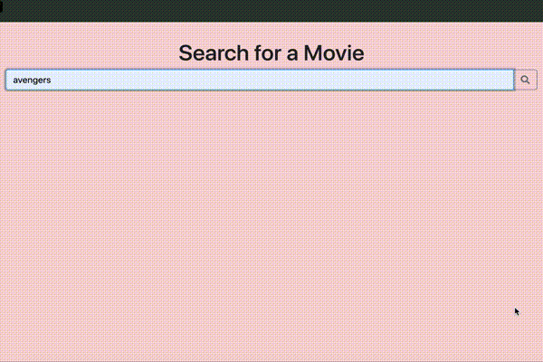

## Movie Search App
- Search and show movie details from [The Movie Database (TMDb) API API](https://developers.themoviedb.org/3/getting-started/introduction)  
[website](https://movie-search-5c6ee.firebaseapp.com/)
- Using Bootstrap, Sass/SCSS, jQuery & Axios

## Demo

## Functionalities
- Search movies through the TMDb API
- Click on search results to see movie details, including an embedded Youtube trailer and its IMDb link
- Host on firebase
